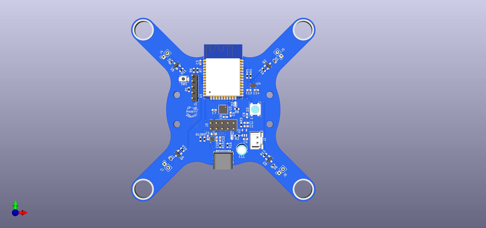
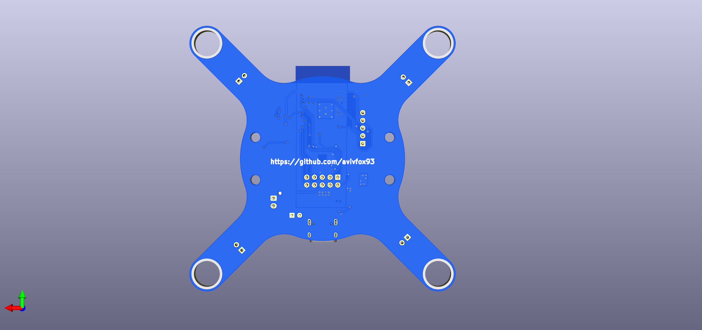

## ESP32-Drone Hardware

### Introduction

Hardware design for dron based of ESP32 and BME6050. It desinged using KiCad 6. Parts chosen for both low cost and stocks availability.

### Features

1. ESP32 MCU
2. MPU6050 IMU
3. BMP280 barometer
4. LiPo charger
5. WS2812b indication LED
6. External peripherals extension connector
7. On board 8mm motor sockets

### Remarks
1. Better to manufacure PCB 1.0 mm in thickness
2. Better to solder the motor on both sides, motors might tear the copper layer if its not soldered well

### Firmware
Can be used with my fork of ESP-Drone (based on Crazyflie) -> https://github.com/avivfox93/esp-drone
